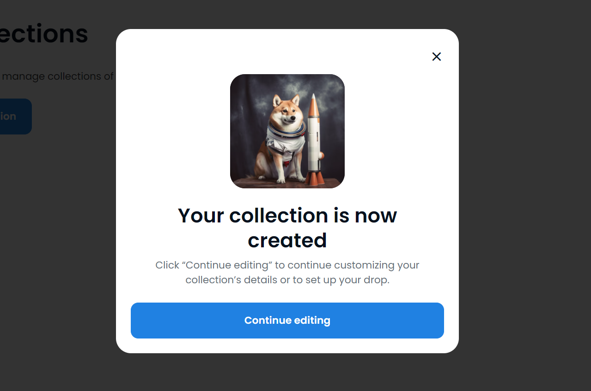

## 手把手发一个图狗

#### 目录

* 图片获取
* NFT合约
* 网站部署
* trigger mint
* 推特以及其他注意事项

#### 图片获取

* 作为一个图狗，最重要的是图片，一波流的关键就是第一印象的图片，因此图片一定是要足够的惊艳，通常设计图片有以下几个方法：

  * 绘制各个trait，组合
    * 未完成，应该用python可以组合的
    * [方法参考](https://medium.com/scrappy-squirrels/tutorial-create-generative-nft-art-with-rarities-8ee6ce843133)

  * ai生成
    * [midjourney](https://www.midjourney.com/home/) ： $30/mon 闲鱼拼车13r/mon  高质量
    * new bing ： free，低画质，生成完可以去[bigjpg](https://bigjpg.com/)高清放大一下
    * stable difussion ：free，需要自己搭环境

#### NFT合约

* NFT合约一般情况下不建议手写，可以用现成的工具，写的还比你的好

  * 当主网gas price=56（很高了）的情况下，使用manifold部署合约及相关的gas fee如下,其他的方法可以参考，可以看出，使用proxy部署合约的gas fee大大减少了

  | Action                                | Cost in ETH （gas 56） |
  | ------------------------------------- | ---------------------- |
  | Contract Deployment                   | 0.014                  |
  | Mint one ERC721                       | 0.011                  |
  | Mint one ERC1155                      | 0.011                  |
  | Mint ten ERC1155                      | 0.011                  |
  | Airdrop one ERC721 to one wallet      | 0.013                  |
  | Airdrop one ERC1155 to one wallet     | 0.012                  |
  | Airdrop one ERC1155 to four wallets   | 0.017                  |
  | Set contract royalties to one wallet  | 0.007                  |
  | Set contract royalties to two wallets | 0.009                  |
  | Set token royalties to one wallet     | 0.007                  |
  | Set token royalties to two wallets    | 0.010                  |

  * 工具类

    * os drop 顶级的定制，丝滑的部署，os seadrop合约提供全套服务，优点是支持多链，部署可以proxy降低费用，配件齐全。缺点是他不调用safemint，不一定能trigger到土狗。

    ​		a. 创建collection ，填写基本信息

    

    

    

    ​	

    

    接下来进入collection编辑drop页面

    像改ppt一样改drop界面，done，[示例](https://opensea.io/collection/rocket-gensis/edit?tab=dropEditor)

    

    ---

    * [mintfun](https://mint.fun/feed/trending)： 因为这个平台发图狗太多了已经没什么人去打了，但是最近融资了可以交互一波？
    * [manifold](https://manifold.xyz/)  :[个人面板](https://studio.manifold.xyz/),manifold的面板很完善了，burn，bunchmint都可以了，还有完善的gas预估，预算控制到头发，主要以OE为主。

  * 自己写
    * 自己写的优点是灵活性高，但是部署的gas，安全性都很难说
    * 可以使用的较为基础的工具是 [thirdweb](https://thirdweb.com/dashboard)，支持部署模板合约，增减功能，相较于直接用工具类显然更加的灵活，支持多链，缺点是你还得写配套网页去mint
    * remix自己写，不建议，首先部署费用就让土狗很难回本

#### 网站部署

* 网站搭建，如果使用了工具类制作NFT合约,那你无需网页mint，只需要搭个花里胡哨的架子，搭架子可以用以下途径
  * markdown 最简单的写个网站，跟写word一样简单，不过网页会显得比较简陋而且只能是静态网页
  * [shuffle](https://shuffle.dev/)：快速搭建美观的网站，收费
* 服务器部署
  * 因人而异，本着打一炮就走的原则，我选择github page+域名的静态网站
  * 其他：待补充

#### trigger mint

* 由于opensea drop 不能引起机器人trigger mint，这个先鸽

####  推特以及其他注意事项

* 推特可以查询用户名更改记录的，所以发图狗请别狂用一个号
* 抓热点是关键

---

